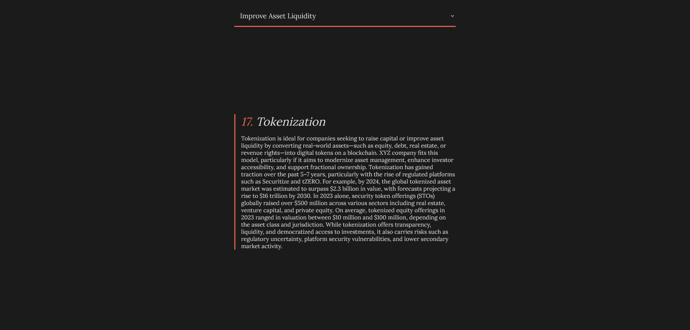

# Market Seeker



## Table of Contents
- [About](#about)
- [Usage](#usage)
- [Architecture](#architecture)
- [Live Website](#live-website)

## About
A Capital Market query tool for businesses looking to inform themselves about various markets using keywords that align with their needs, current situation, or concerns.

## Usage
Markets can be queried using tailored-keywords that correspond to different user needs: 
1. Businesses that have specific needs (tokenization, immediate cash flow, etc).
2. Businesses that want to inform themselves of the risks that come with different markets (no guarantee of job creation, regulatory uncertainty, etc).
3. Businesses that have a favorable market in mind and wish to research it further (Bridge Financing, Tokenization, etc).

## Architecture
```
/src
|-- /assets # Static assets such as images
|-- /components # Reusable React components
|---|--- Content.tsx # The container responsible for rendering the market and landing page information 
|---|--- Dropdown.tsx # The dropdown component containing all the keywords; responds to change and then conditionally updates the data rendered within Content.tsx
|-- /data
|---|--- Keywords.ts # Holds the actual keyword data categorized by arrays that correspond to different markets
|---|--- Markets.ts # The market data that is conditionally rendered within Content.tsx depending on the current keyword
|-- /types # Contains type data
|---|--- ContentTypes.ts # Defines content type
|---|--- DropDownProps.ts # Defines types for the dropdown component props
|-- /utils # Functions for general purpose functionality
|---|--- Dictionary.ts # The actual dictionary that maps a keyword to a market, allowing for constant-time search
|-- App.tsx # Top-level component for rendering the page
|-- index.css # Page styling
|-- main.tsx # Entry point for app
|-- vite-env.ts # Metadata for vite
```